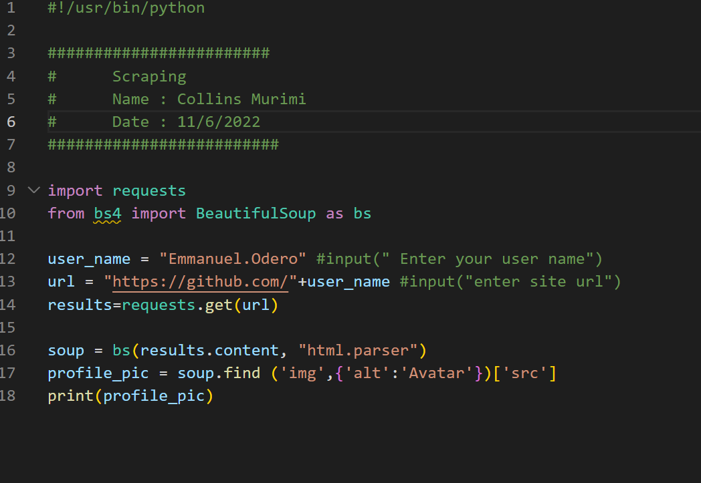

### INSPIRE YOUTH IN STEM

## Week 1: Introduction to python
   Day 1 : Installing python
   
   Add link to python download
https://www.bing.com/search?q=python+download+windows&form=WNSGPH&qs=AS&cvid=da4200cd98904645a8e5605474d1ad62&pq=python+download&cc=US&setlang=en-US&nclid=4E1E3F3F1D53AB07C2AE40562DECAE46&ts=1652862426370&wsso=Moderate
   Add link to download vs code
https://www.bing.com/search?q=vs+code+download+for+windows+10&form=WNSGPH&qs=AS&cvid=3361145e56b64f3da93320ed5446f957&pq=vs+code+do&cc=US&setlang=en-US&nclid=4E1E3F3F1D53AB07C2AE40562DECAE46&ts=1652862502451&wsso=Moderate
   add link to download git for windows
https://www.bing.com/search?q=git+download&form=WNSGPH&qs=AS&cvid=bf11c1302f6f4c8aaf3ebec33fbdfb79&pq=git+dow&cc=US&setlang=en-US&nclid=4E1E3F3F1D53AB07C2AE40562DECAE46&ts=1652862539148&wsso=Moderate
 
[lesson1](./Images/Lesson1.png)

   Day 2:Variables and Data Types
         python assignment4.py
         Variable - memory allocation inside a computer
                    e.g message = "Hello there"
                        (variable)    (data)

          Data types e.g  (1) numbers (integers)
                          (2)  letters and words (strings) 

   Day 3: String Methods                                  
         strings :
                  replace()
                  upper()
                  lower()
                  len()

   Day 4: Lists and Loops

          (1)lists - [] , indices 
          (2)working with lists - pop,del,append,remove
          (3)loops
## Week 2: Electronics for innovators
   Day 1 : lesson 7
           Types of variables : (1)Camel case
                                (2)Snake
           Casting - converting from one data type to another
                 e.g fuel = 17.21
                     new fuel = int(fuel) -- decimal trancated

                        str(name)
                        float(____)

            Multiplication table
            Square of numbers
            Initializing a dictionary
            Empty dictionary
            Loops
            
   Day 2: Lesson 8, Assignment 4

      Writing programs to withdraw and deposit money
      Empty lists
      Printing squares,cubes,sum

   Day 3 : Assignment5, #Git Commands
         
           # Dictionaries
             Dictionaries(python) use {} not []
                dictionary[key] = 'value'
           git add* --- all files
           git add lesson4.py --- single file
           git commit -m "lesson on if ststements"
           git branch -M main
           git config -- global user.name="collinsmiriti@gmail.com"
           git remote add
           git push

           #######
           (1)What is a dictionary
           (2)Syntax for dictionary
           (3)define , add , remove
           (4)Looping over dictionaries
           (5)dictionary in dictionary
              list in dictionary
              dictionary in list

   Day 4 : Lesson 9
           # Loops (1) for loops
                   (2) while loops

           # Conditions 
             (if) condition

           # Operations : <-  less than
                          <=  less equal
                          >-  greater than
                          >=  greater equal
                          ==  assignment
                          %   modulus

## Week 3: Introduction to robotics
 
   Day 1 : #Review on dictionaries 
           #Divisibility of numbers 
           #Writing a program to print numbers in reverse
           

   Day 2 : #Tuples 
           #Mutable and Immutable 
           #Functions
           #Function Parameters
           #Quadratic equation
               y1 = -b + math.sqrt((b*2) - 4*a*c)/2*a
               y2 = -b - math.sqrt((b*2) - 4*a*c)/2*a

   Day 3 : PUBLIC HOLIDAY

   Day 4 : (1)Classes
           
           (2)Objects

   Day 5 : #Function - block of code 
           
           #Functions file
            *Using default parameters
            *Return from a file
            *Square of numbers
            *Returning a dictionary from a function
            *Parsing a list in a function

            #Revision on classes 
            
            ##### PROJECTS #####

## Week 4: Javascript , css ,html
   
   Day 1 : #Lesson on Classes
           
           ### students.py ###
           ### teachers.py ###

     

   Day 3 : #Project on digital clock

           #Project on analogue clock

   Day 4 : 

   Day 5 : # Scraping.py
             Learnt about scraping

            #Installation of ### bs4 ###

             
## Week 5 : Design thinking ,UX ,UI

## Week 6: Pitch competition, campus tour
